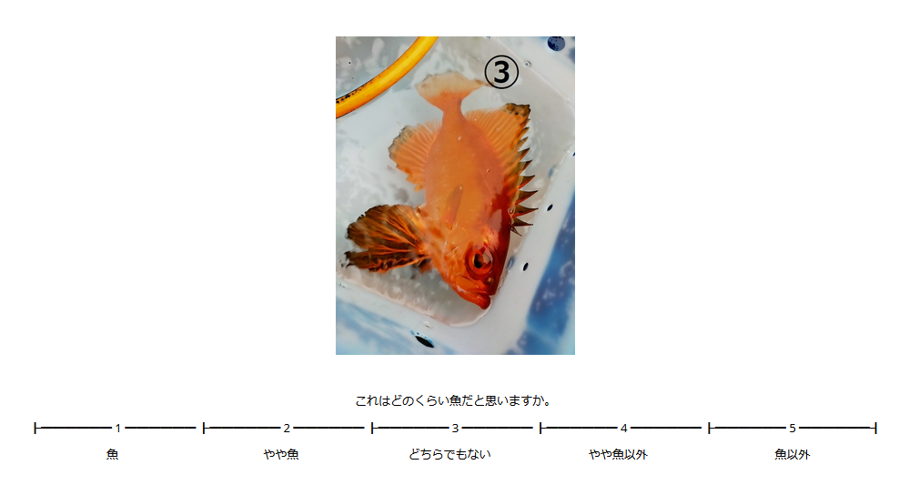

# temochiz-2021-tutorial
jsPsych ver.7.0.0 用テストプロダクト

# 概要
jsPsych ver.7.0.0 をテストするために作成してみました。  
魚や、魚っぽい画像が出てくるので、どの程度魚っぽいのかを回答するプログラムです。  

# プログラムの動作 
1.学籍番号、性別、年齢の入力  
2.実験開始のメッセージ  
3.凝視点  
4.画像を表示して、「これはどのくらい魚だと思いますか。」→ 1-5のキーを押して回答  
5.(3と4を繰り返し)  
6.終了メッセージ  

# インストール方法
[jsPsych7.0.0](https://github.com/jspsych/jsPsych/releases/tag/jspsych%407.0.0) をインストールしたディレクトリ内に、コピーしておきます。  
こんなディレクトリ構成になります。  
  
jsPsych7  
-- dist  
-- examples  
-- temochiz-2021-tutorial

# 実行方法
index.html のクリックで実行します。
